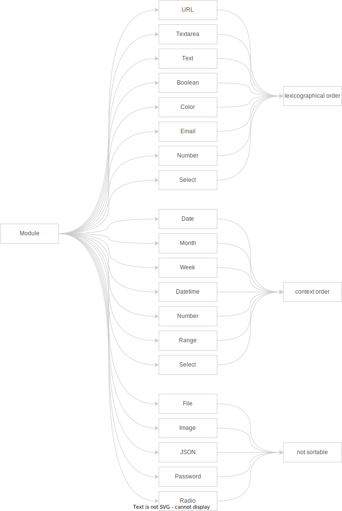

# Cascara Table: Record Sort

Cascara Table supports a wide range of data types a/k/a Modules, this makes sorting more complex. Whilst some Modules are sorted _lexicographically_ (URL, Text, Email, Select, etc), some others are sorted under a _given context_ (Date, Month, Range, etc), and the rest are simply _not sortable_ either because they are too complex, like JSON; or a File, which is impractical.

The initial implementation leveraged **Ramda**, but given the complexity of our use case, a comprehensive solution is required.

