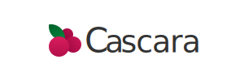

Espressive's Functional Design System (FDS)


[](http://commitizen.github.io/cz-cli/)

## Getting Started: End Users

Please use [the documentation site](https://cascara.design) for all information about Cascara and how to use it: https://cascara.design

> All other usage information in this repository is intended for contributors.

---

## Get Started: Docs 📚📖

1. Clone the repository to your local machine (UX Team will use [Tower](https://www.git-tower.com/mac) to do this)
2. Open the repository in [VSCode](https://code.visualstudio.com/)
3. Open a new terminal in VSCode to run some commands using Terminal > New Terminal or the shortut: <kbd>Ctrl</kbd> + <kbd>~</kbd>
4. In the terminal, install all dependencies by running the following command:

```bash
yarn install
```

> It is possible you may not have node or yarn installed on your system. If this step fails, please follow the additional steps below to [Install NVM](#install-nvm) and [Install Yarn](#install-yarn) before coming back to try this step again. If you already know how to install these missing dependencies and get the correct versions, using tools like Homebrew, go for it.

5. To start the docs, run:

```bash
yarn docs start
```

6. Visit the following link in your browser to see the docs running locally: http://localhost:3000/
7. Edit any MDX files in `/packages/cascara/src` or in `/docs/src/mdx` and they will automatically reload 🎊

#### Install NVM

We use Node and Node Packages in our codebase. Node has _lots_ of different versions, and at times there are reasons we might need to switch to different versions. Therefore we should install Node Version Manager to allow us to switch versions easily.

0. Check if nvm is already installed

```bash
nvm version
```

> If the output of this command is `nvm: command not found`, proceed to install step 1. If the output of this command is some version number, you already have `nvm` installed and can proceed to step 3.

1. Run the CURL command in the terminal to install:

```bash
curl -o- https://raw.githubusercontent.com/nvm-sh/nvm/v0.35.3/install.sh | bash
```

2. Verify that `nvm` has been installed:

```bash
nvm version
```

3. If the output of the above command is `v14.18.2` you are done! 🎉
4. If not... set the current version of node to 14.18.2:

```bash
nvm install 14.18.2
nvm alias default 14.18.2
```

5. Go back to step 2 and verify the correct version of Node is installed

#### Install Yarn

We use [Yarn](https://classic.yarnpkg.com/) as our Node Package manager. It is responsible for installing, updating, and managing our dependencies in this monorepository. There is a 2.x version of Yarn available, but for now we are sticking with the latest version of the 1.x branch. Be aware of this if you ever need to look at documentation.

0. Check if `yarn` is already installed

```bash
yarn -v
```

> If the output of this command is `yarn: command not found`, proceed to install step 1. If the output of this command is some version number, you already have `yarn` installed and can proceed to step 3.

1. Run the CURL command in the terminal to install:

```bash
curl -o- -L https://yarnpkg.com/install.sh | bash
```

2. Verify that `yarn` has been installed:

```bash

yarn -v
```

3. If the output of the above command is `3.1.1` (or higher) you are done! 🎉
4. If not... get some help from a teammate on how to update your version of `yarn`

We need to update this soon...

## Contributors

This project exists thanks to all the people who contribute. [[Contribute](CONTRIBUTING.md)].
