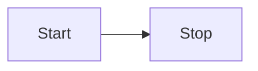

# Cascara

#### Espressive's Functional Design System

---

## TOC

1. Benefits of a Design System
2. Design Systems
3. Delivery Phases
4. Strategies

---

## `1` Benefits of a Design System

- Increased velocity
- More consistent user experience
- More maintainable codebase
- Single source of truth :raised_hands:

---

## `2` Design Systems

> A Design System is the single source of truth which groups all the elements that will allow the teams to design, realize, and develop a product.
>
> <footer>Audrey Hacq</footer>

- **Brand Guidelines** (Color, Typography, Logo, Copy) :art:
- **UI Library** (Components, Layout, Animation) :triangular_ruler:
- Experience & Pattern :eyes:
- Rules, Constraints, Principles :scales:
- Icons/Images/Illustrations :frame_with_picture:

---

### What is a _Functional_ Design System?

> A Functional Design System is a superset of a design system. It has additional components that help enforce experience, patterns, and other rules of the Design System as a whole.
>
> <footer>@bje</footer>


- Update a single "margin" value in our tokens:
  - All design prototypes get updates
  - All UI library gets updated
  - All documentation gets updated

---

### What is Cascara?


Cascara is the husk of a coffee bean cherry.

Cascara is also the name of Espressive's Functional Design System. :coffee:

---

## `3` Phases

<Split>

#### 2020 Q3

- `0.1.0`
  - POC
- `0.2.0`
  - API Container Components
  - Filtering
  - Tables

</Split>
<Split>

#### 2020 Q4

- (early)
  - Auto generated documentation
  - Begin refactor components with deprecated dependencies
- (mid)
  - Forms
  - Chat

</Split>

---

<Split>

#### 2021 Q1

- early
  - Begin new UI system (start replacing SUI in API Container Components)

</Split>

---

## `4` Strategies

- API Container Components
- Clean up alpha versions of components we have already
  - Table
  - Pagination
  - Wizards
  - Tooltip
- Refactored components with deprecated dependencies or incorrect usage
  - `react-fela` (ChatMessage, ChatInput)
  - `React.createRef()` (DatePicker, HierarchyPicker)
- “New” Components

---

### API Container Components

- Reduce API Surface Area :chart_with_downwards_trend:
  - Find repeated patterns
  - Eliminate impossible prop combinations
  - Mute anything not top-level we do not support
- Separation of concerns :scissors:
  - Display
  - Functionality
  - Implementation (outside of FDS)

---

```jsx
import { Button } from 'semantic-ui-react';

<Button
  active
  animated={false}
  as={Link}
  attached='top'
  basic
  circular={false}
  color='red'
  compact
  disabled
  floated='right'
  fluid
  icon='globe'
  inverted
  label='Test'
  labelPosition='right'
  loading
  negative
  positive
  primary
  secondary
  size='mini'
  toggle
/>;
```

---

```jsx
import { Button } from 'semantic-ui-react'

const CascaraButton = ({
  as,
  indicating
  isActive,
  isDisabled,
  isFluid,
  isLoading,
  isPrimary,
  ...rest // We may have to mute some props here
}) => (
  <Button
    {..rest}
    active={isActive}
    as={as}
    basic={!isPrimary}
    disabled={isDisabled}
    fluid={isFluid}
    loading={isLoading}
    negative={indicating === 'negative'}
    positive={indicating === 'positive'}
    primary={isPrimary}
    size='medium'
  />
);
```

---

```jsx
cont getComplexProps = (more) => {
  // Do some complex stuff here

  return {
    new,
    props,
  }
}

const getOtherComplexProps = (simple, api) => ({more,complex,props})

const ComplexImplementation = ({
  more,
  simple,
  api,
  ...rest
}) => {

  // We have complete control over how the existing API maps to any internal components

  return(
    <Table {...rest} {...getNewProps(props)} {...getOtherComplexProps(simple,api)} />
  )
};
```

---


