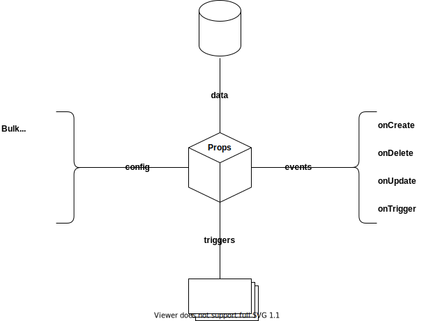

# Technical Design - Espressive Table

# Current implementations

As of `goldengirls` release, we use tables in the following applications:

Barista:

- Admin
  - Service Department
  - Service Teams
  - Barista FAQs
  - Users
  - Locations

Caffeine

- Configuration
- Entities
- Localization
- Training
- Variables
- Status
- Doppio

## Features in tables

The features in those tables vary from one implementation to another, but the general idea is to present the data in a tabular way, ussually also providing the means for data persistance. The aggregated features list is the following:

**Item creation**:
Some tables allow the user to create a new entry in the table. Adding an empty row.

**Inline edition**:
Some tables allow the user to edit the data, replacing the display representation with some JSX that allows the mutation of the data.

**Item deletion**:
Some entities in our API allow item deletion, some others don't. The `delete` functionality must be `opt-in`.

**Custom actions**:
In most implementations, tables add a trailing column to each row. This row can display `action buttons`, which can be mapped to corresponding actions over the entire row. i.e. edit, delete, cancel, etc.

All of the features mentioned above must be `opt-in`.

## Data representation / mutation

The way each cell represents the data for either display or edit purposes not only depends on the data type but also on business logic, in most cases, values are easily coerced to string for display purposes and updates are easily achieved via a controlled input component. The rest of scenarios require a more complex implementation, e.g. the `employee` field in the `Users` table from `Barista Admin` which under the carpet is a single `eid`, but the representation of that cell is an avatar with the user name it points to, although it could be any other representation, specially when editing the value.

Note: The updates made to any row would be notified upstream via `events` so the parent component is able to persist those changes. The means by which the table enables data mutation are to be provided by the developer in the form of `triggers`, the table doesn't provide such means.

# Proposal

Much thought has been put to the proposal described in this section, our goal is to create a table that can support all of our current use cases while at the same time being abstract enough to support future ones. We are not inventing the wheel here, there are great open source libraries like `react-table`. The problem with those libraries is that they are bloated with things we don't need either because we already abstracted such functionality out to other components or we simply don't need it.

## Espressive CRUD Table

Given the nature of our actual tables and the operations we need to perform on the data entities, a CRUD Table starts to make sense. A kind of table that not only displays data in a nice tabular way, but also allow for a richier interaction with the data.

It is true that CRUD operations are needed in less scenarios, so the CRUD feature must be easily enabled and must not interfere with the regular table logic. 

## Props



### Events

In order to support CRUD operations, we must define a mechanism to communicate the parent any changes to the data.

- onCreate
- onUpdate
- onDelete
- onTrigger

Please note that the names could have been something like `onItemCreate` for semantics, but let's remember that in the future we plan to support selection and custom actions on multiple items. Our proposal is to keep these as abstract as possible.

| Event     | Signature                                         | Description                                                     |
| --------- | ------------------------------------------------- | --------------------------------------------------------------- |
| onCreate  | `(Object: newItem) => {}`                         | Fired when the User saves a new item                            |
| onUpdate  | `(Array[Object]: updatedItems) => {}`             | Fired when one or more rows have been updated by the User       |
| onDelete  | `(Array[String]: selectedItems) => {}`            | Fired when one or more rows have been deleted by the User       |
| onTrigger | `(String: actionType, Array[String]: data) => {}` | Fired when a custom action has been applied to one or more rows |

### Config

There will be use cases where features like multi-selection, CRUD, custom actions, etc. won't be required at all, they must be disabled by thefault but easily activated. It makes sense to have boolean props that controll such features.

Another important aspect of configuration is the definition of columns, hence a complete section is devoted to it.

| Name               | Type          | default | Description                                        |
| ------------------ | ------------- | ------- | -------------------------------------------------- |
| Bulk (enhancement) | Boolean       | `FALSE` | If true, activates the bulk mode (multi-select)    |
| Columns            | Array[Object] | `[]`    | Holds the definitions for each column in the table |
| Create             | Boolean       | `FALSE` | If true, activates the creation of new items       |
| Delete             | Boolean       | `FALSE` | If true, activates the deletion of items           |
| Update             | Boolean       | `FALSE` | If true, activates the edit mode                   |

### Triggers

Custom actions are present in most tables, they are an important aspect of all applications. The nature of the actions depends on the entity they are applied to, hence, an abstract way of defining custom actions is required.

| Attribute | Type     | default      | Description                                                 |
| --------- | -------- | ------------ | ----------------------------------------------------------- |
| id        | String   | `''`         | The id of the action, usually the name.                     |
| callback  | Function | `noop`       | The function to be called when the action button is clicked |
| trigger   | ANY      | `<Button />` | The element that will trigger the action                    |

### Data

The data passed to the table for rendering purposes.

| Name | Type          | default | Description                                   |
| ---- | ------------- | ------- | --------------------------------------------- |
| data | Array[Object] | `[]`    | the tabular data to be displayed by the table |

### Columns

The definition of columns depends on the data, we must make sure we have a well-defined set of data types to allow display and mutation for each one.

| Attribute  | Type                                                                   | default    | Description                                              |
| ---------- | ---------------------------------------------------------------------- | ---------- | -------------------------------------------------------- |
| attribute  | String                                                                 | `null`     | The name of the entity attribute that maps to the column |
| isEditable | Boolean                                                                | `FALSE`    | Specifies if the cells are editable                      |
| label      | String                                                                 | `''`       | Label text to display with this attribute                |
| type       | Enum[`boolean`, `date`, `image`, `link`, `number`, `string`, `render`] | `'string'` | Specifies the type of data for the column                |

### Data types

The data types this table can handle are the following:

For display puposes: `boolean`, `date`, `image`, `link`, `number`, `string` and `render`. The `render` type being a custom JSX.

For mutation purposes, the implementation will support `select`, `input`, `boolean switch`, `date / time pickers`, `lookup select`. With the ability to expand to more types.

## Context

All the internal logic will be hosted in a Context. The definition is WIP.

## The complete JSX picture

```
<Table
  // config
  bulk
  create
  delete
  update

  coluns=[{}]

  // events
  onCreate={this.handleNewItem}
  onDelete={this.handleItemDelete}
  onUpdate={this.handleItemUpdate}
  onTrigger={this.handleTriggers}

  // triggers
  triggers={[
    { id: 'cancel',  ...additionalConfig },
    { id: 'view',  ...additionalConfig },
  ]}

  // data
  data={[{}]}
/>
```
